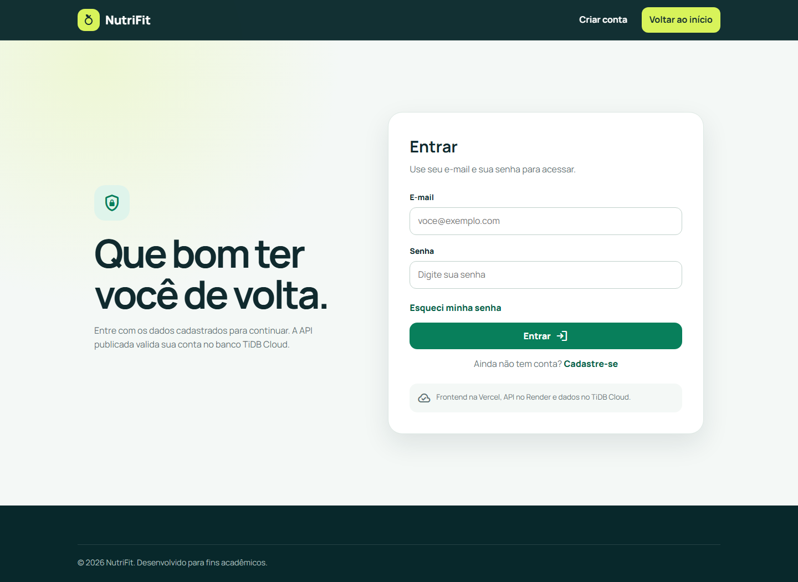
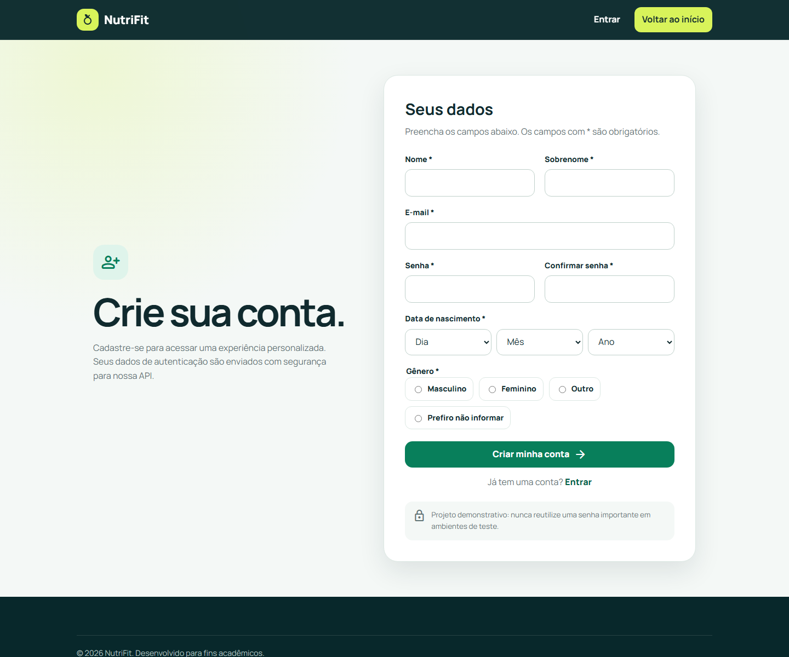
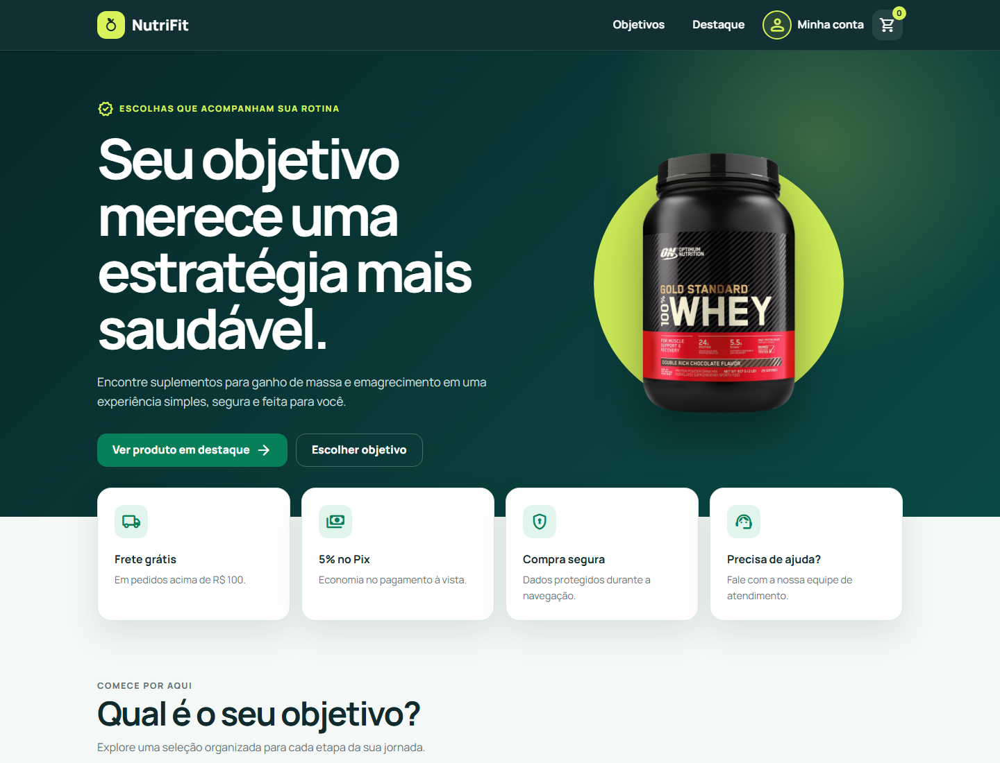
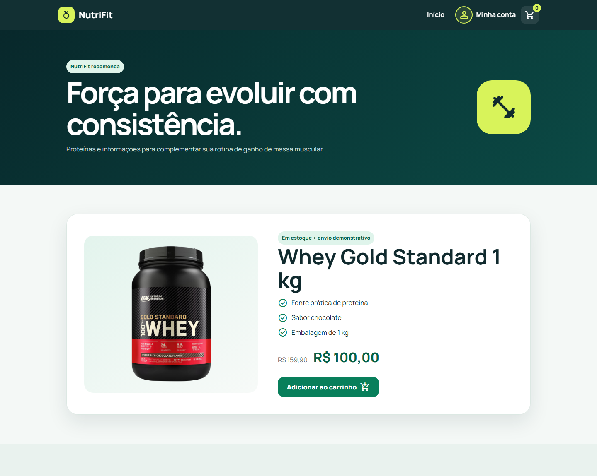

# NutriFit

E-commerce acadêmico de suplementos com cadastro e autenticação integrados a uma API pública e banco de dados em nuvem.

[](https://projeto-integrador-lilac.vercel.app/)
[](https://nutrift-api.onrender.com/)
[](https://www.pingcap.com/tidb-cloud/)
[](#testes)

## Sobre o projeto

O NutriFit nasceu como Projeto Integrador do Grupo 8 e evoluiu para uma aplicação full stack demonstrativa. O frontend apresenta categorias e produtos, permite criar uma conta e autenticar usuários. A API aplica validações, protege senhas com bcrypt e persiste os dados no TiDB Cloud.

> Este é um projeto acadêmico. Produtos, preços, depoimentos e contatos são demonstrativos.

## Aplicação publicada

- Frontend: https://projeto-integrador-lilac.vercel.app/
- API: https://nutrift-api.onrender.com/
- Repositório atual: https://github.com/MarceloRodrigues1853/Nutrift

Em hospedagem gratuita, a primeira chamada à API pode demorar alguns segundos enquanto o serviço do Render é reativado.

## Interface

### Página inicial


<details>
  <summary>Ver telas de autenticação</summary>

### Login



### Cadastro



</details>

### Área logada e catálogo





## Arquitetura

```text
Navegador
   │
   ▼
Vercel (HTML, CSS e JavaScript)
   │  HTTPS / REST
   ▼
Render (Node.js + Express)
   │  TLS / mysql2
   ▼
TiDB Cloud (compatível com MySQL)
```

Para desenvolvimento local, o projeto também oferece MySQL 8.4 por Docker Compose.

## Funcionalidades

- Home responsiva com categorias e produto em destaque.
- Cadastro com validação de nome, e-mail, senha, data de nascimento e gênero.
- Bloqueio de e-mails duplicados.
- Login com senha armazenada como hash bcrypt.
- URL da API selecionada automaticamente entre ambiente local e produção.
- Conexão TLS com TiDB Cloud.
- Rodapé com ano atualizado automaticamente.
- Cinco testes automatizados de cadastro e autenticação.

## Tecnologias

### Frontend

- HTML5 semântico
- CSS responsivo
- JavaScript
- Google Material Symbols

### Backend e dados

- Node.js
- Express
- mysql2
- bcryptjs
- TiDB Cloud
- MySQL 8.4 e Docker Compose para desenvolvimento local
- Test runner nativo do Node.js

### Deploy

- Vercel para o frontend
- Render para a API
- TiDB Cloud para o banco

## Executando localmente

### Pré-requisitos

- Node.js 20 ou superior
- Docker Desktop, para usar o banco local
- Git

### 1. Clone o repositório

```bash
git clone https://github.com/MarceloRodrigues1853/Nutrift.git
cd Nutrift
```

### 2. Configure o ambiente

Copie `backend/.env.example` para `backend/.env` e substitua as senhas de exemplo.

```env
DB_HOST=localhost
DB_PORT=3307
DB_USER=nutrift
DB_PASSWORD=uma_senha_local
DB_ROOT_PASSWORD=uma_senha_root_local
DB_NAME=db_Nutrift
DB_SSL=false
PORT=3000
```

Nunca envie o arquivo `.env` ao GitHub.

### 3. Inicie o MySQL local

A porta externa padrão deste projeto é `3307`, evitando conflito com uma instalação local do MySQL na porta `3306`.

```bash
docker compose --env-file backend/.env up -d
docker compose ps
```

O script `db_Nutrift/init.sql` cria a estrutura inicial na primeira inicialização do volume.

### 4. Instale e inicie a API

```bash
cd backend
npm ci
npm start
```

A API ficará disponível em `http://localhost:3000`.

### 5. Abra o frontend

Sirva a raiz do repositório com a extensão Live Server do VS Code e acesse:

```text
http://127.0.0.1:5500/frontend/index.html
```

Em `localhost` ou `127.0.0.1`, o frontend utiliza a API local. Nos demais domínios, utiliza a API publicada no Render.

## Testes

Na pasta `backend`:

```bash
npm test
npm audit
```

A suíte cobre cadastro válido, e-mail duplicado, login válido, usuário inexistente e senha incorreta. Os testes usam uma conexão simulada e não alteram o banco configurado no `.env`.

## Variáveis de produção

A API no Render utiliza:

- `DB_HOST`
- `DB_PORT`
- `DB_USER`
- `DB_PASSWORD`
- `DB_NAME`
- `DB_SSL=true`

As credenciais são segredos de ambiente e não devem ser incluídas em commits, prints ou documentação pública.

## Segurança implementada

- Hash de senha com bcrypt.
- Consultas parametrizadas ao banco.
- E-mail único na aplicação e no esquema SQL.
- TLS obrigatório na conexão com TiDB Cloud.
- Segredos fora do repositório.

## Evidências do fluxo

O fluxo completo já foi validado em produção:

1. Cadastro iniciado pelo frontend na Vercel.
2. Requisição processada pela API no Render.
3. Usuário persistido no TiDB Cloud com senha em hash.
4. Login autenticado pela API pública.

As capturas da interface modernizada estão versionadas em `docs/screenshots/`, sem dados pessoais, credenciais ou conteúdo do banco.

## Créditos de interface

Os ícones de interface usam [Google Material Symbols](https://developers.google.com/fonts/docs/material_symbols), disponibilizados sob licença Apache 2.0. As imagens de produtos são mantidas localmente no repositório para evitar links quebrados e dependência de hotlink.

## Equipe original

- Diego
- Marcelo
- João
- Juliana
- Rodrigo

## Contribuição

Crie uma branch a partir de `main`, faça alterações pequenas e verificáveis e abra um Pull Request para `MarceloRodrigues1853/Nutrift`.

```bash
git switch main
git pull --ff-only origin main
git switch -c minha-melhoria
```

## Licença

Consulte as licenças dos recursos visuais antes de reutilizá-los fora deste projeto. O código permanece sujeito aos termos definidos pelo repositório.
